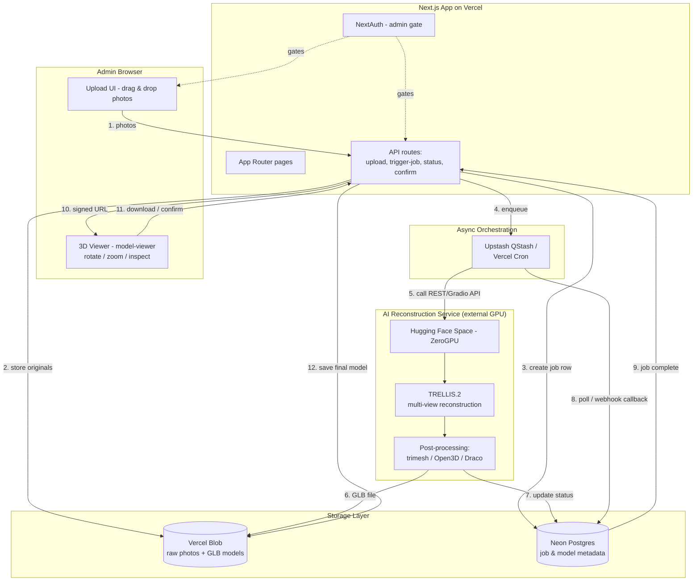
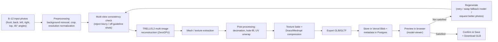

# AI-Based 3D Spectacles Generation System
### Technical Proposal & Architecture Document
**Prepared:** July 13, 2026

---

## 1. Executive Summary

This document proposes a standalone web application that lets an admin upload multiple photos of a spectacles frame and receive back an interactive, downloadable 3D model (GLB/GLTF) for use on an e-commerce site. It covers the AI method comparison, final tech stack, architecture, AI workflow, roadmap, timeline, limitations, and expected accuracy.

**Bottom line up front:**
- The best available open-source approach in mid-2026 is a **multi-view diffusion + feed-forward reconstruction model**, specifically **TRELLIS.2** (Microsoft Research, MIT license), which natively supports combining several photos of the same object into one 3D asset.
- **True zero-cost is achievable for prototyping and low-volume internal use**, but two caveats matter: Vercel's free "Hobby" tier is contractually non-commercial, and free GPU compute (Hugging Face ZeroGPU) is quota-limited per day. Both are workable for an admin tool generating a handful of models a day; neither is free at e-commerce catalog scale.
- **Glasses are an intrinsically hard case** for any photo-based 3D method because of transparent/tinted lenses and thin reflective metal frames — this is a well-documented open problem in 3D vision research, not a tooling gap. Expect very good frame geometry and approximate/simplified lenses, not survey-grade or manufacturing-grade output.

---

## 2. Research: Comparing 3D Reconstruction Approaches

### 2.1 The four families of methods

| Approach | How it works | Multi-image native? | Speed | Hardware | Typical output | Fit for glasses |
|---|---|---|---|---|---|---|
| **Classical photogrammetry** (COLMAP + OpenMVS, Meshroom/AliceVision) | Matches features across many photos, triangulates a point cloud, meshes it | Yes (needs 20–100+ images normally) | Slow (minutes–hours) | CPU-friendly, no GPU required | Textured mesh (OBJ) | Poor — feature matching fails on thin, reflective, low-texture frames and transparent lenses |
| **NeRF-based reconstruction** (Nerfstudio, Instant-NGP) | Learns a volumetric radiance field from posed images, renders novel views | Yes, but needs precise camera poses and many views | Moderate–slow training per object | GPU required | Volumetric render, mesh extraction is a secondary, lossy step | Moderate — can capture some reflections/refractions better than photogrammetry, but mesh extraction and export to GLB is fiddly |
| **3D Gaussian Splatting** | Optimizes a cloud of 3D Gaussians to match input views; fast to render | Yes, similar input needs as NeRF | Fast training (minutes), real-time render | GPU required | Gaussian splat scene (not a classic mesh) | Good for splat-based preview; converting to a lightweight GLB mesh for a website adds an extra conversion step and quality loss |
| **Multi-view diffusion + feed-forward reconstruction** (TRELLIS.2, Hunyuan3D 2.1/3.0, InstantMesh) | A diffusion model generates consistent additional views, then a feed-forward network directly regresses a 3D mesh + texture | Yes — several of these (notably TRELLIS.2) accept multiple real photos directly as conditioning | Fast (seconds–low minutes) | GPU required, but shareable/on-demand GPU works well | Clean mesh + texture, exports to GLB/OBJ | **Best fit** — most robust to imperfect capture conditions, designed for exactly this "few photos → web-ready 3D asset" use case |

This is the dominant, most actively developed pattern in the field right now: <cite index="1-1">a diffusion model generates several consistent 2D views, then a feed-forward network reconstructs the 3D mesh, which is the dominant pattern in 2026 because it produces the cleanest topology.</cite>

### 2.2 Model shortlist within the recommended family

| Model | License | Multi-image support | VRAM need | Notes |
|---|---|---|---|---|
| **TRELLIS.2** (Microsoft Research) | MIT | Yes — dedicated multi-view reconstruction mode | ~16 GB | <cite index="4-1">The core model is free and open source; you can run it locally with a GPU at zero per-generation cost, or use the web app's free tier for casual use</cite>. Widely rated as the strongest open, free option for image-to-3D fidelity in 2026. |
| **Hunyuan3D 2.1 / 3.0** (Tencent) | Open, community license | Yes | 24 GB+ for high-quality mode | <cite index="1-1">Hunyuan3D's high-quality mode wants 24GB+ VRAM (RTX 4090 or A100)</cite> — strongest texture fidelity, heavier hardware ask. Good fallback/comparison model. |
| **InstantMesh** | Apache-2.0 | Multi-view diffusion + sparse reconstruction | ~8 GB | Lighter-weight fallback if TRELLIS.2 capacity/queue is a bottleneck. |
| **TripoSR / Stable Fast 3D** | MIT / permissive | Single-image only | Low | Useful only for very fast single-photo prototyping, not the primary pipeline (we have multiple angles available). |

**Recommendation: TRELLIS.2 as the primary engine, InstantMesh as an automatic fallback** if the primary queue is saturated or a specific frame fails to reconstruct cleanly.

### 2.3 Why not pure photogrammetry or NeRF?

Glasses combine three properties that are individually hard for camera-based reconstruction and brutal in combination: thin structures (temples, wire frames), specular/reflective coatings (metal, lacquer), and transparent or tinted lenses. This isn't a matter of picking the wrong tool — it's a well-studied limitation of any method that assumes light bounces diffusely off a surface. Reconstruction of transparent objects is <cite index="7-1">challenging due to the complex image formation principles underlying their visual appearance, and most state-of-the-art reconstruction methods ignore this problem and assume Lambertian (diffuse) reflection</cite>. The same is true for reflective metal: <cite index="11-1">reflective and transparent materials generate specular reflections or refract light that interfere with the conventional algorithms used in acquisition, leading to incomplete or inaccurate 3D models</cite>. This is precisely why we recommend a learned, diffusion-based model over classical photogrammetry — it degrades more gracefully on exactly this kind of object, though it does not fully solve the underlying physics.

---

## 3. Final Recommended Tech Stack

| Layer | Technology | Why |
|---|---|---|
| Frontend / App | **Next.js 15 (App Router) + TypeScript** | Required by brief; server components for the admin dashboard, API routes for orchestration, first-class Vercel deployment. |
| Styling | Tailwind CSS | Fast to build a clean upload/preview UI; pairs naturally with Next.js. |
| Auth (admin gate) | **NextAuth.js** (or Clerk free tier) | Only an admin should upload/regenerate; both have generous free tiers and drop into Next.js cleanly. |
| Image & model storage | **Vercel Blob** | Requested in the brief; supports direct client-side uploads (bypassing function size/time limits) and can serve the final GLB files via CDN URLs the e-commerce site can consume later. |
| Metadata database | **Neon Postgres**, via the Vercel Marketplace integration (branded "Vercel Postgres" in the dashboard) | Vercel deprecated its own managed Postgres/KV in December 2024 and migrated existing databases to Neon; the current "Vercel Postgres" experience is a Neon integration. Stores upload batches, job status, model versions, and download history — matches the brief's "only if metadata storage is required" condition. |
| Async job orchestration | **Upstash QStash** (free tier) or Vercel Cron polling | 3D reconstruction takes longer than a typical serverless function is allowed to run, so the trigger/poll/callback pattern has to live outside the request/response cycle. |
| AI reconstruction engine | **TRELLIS.2**, self-hosted on a **Hugging Face Space with ZeroGPU hardware** | The only realistic zero-cost path to real GPU compute for this workload; <cite index="27-1">ZeroGPU dynamically allocates and releases NVIDIA GPUs as needed, offering free GPU access and is available to use for free to all users</cite>, with H200-class hardware in practice. |
| Fallback engine | InstantMesh (Apache-2.0) | Lower VRAM, faster degradation path if the primary Space is over quota. |
| Preprocessing | `rembg` (background removal), image normalization/cropping | Cleans up user photos before they hit the reconstruction model, closely matching the "plain background, good lighting" guidance already shown in your reference mockup. |
| Mesh post-processing | `trimesh` / `Open3D` (Python), `gltf-transform` (Draco/Meshopt compression) | Decimates polycount, fills holes, bakes textures, and compresses the GLB so it loads fast on a product page. |
| In-browser 3D viewer | **`<model-viewer>`** (Google web component) inside a React wrapper, or React Three Fiber + drei if you want fully custom controls | Out-of-the-box orbit/zoom/pan, AR "view in your space" support on mobile, and native GLB loading — matches the rotate/zoom/inspect requirement directly. |
| Hosting | **Vercel** (Hobby for dev/prototyping, Pro once it's customer-facing) | Requested in the brief. |

---

## 4. Architecture Diagram

---

## 5. AI Workflow

---

## 6. Development Roadmap

| Phase | Scope | Key outputs |
|---|---|---|
| **0. Spike / validation** | Run TRELLIS.2 and InstantMesh against 3–5 real spectacles photo sets (varied frame materials) before writing any product code | Go/no-go on expected quality; confirms which model becomes primary |
| **1. Foundations** | Next.js scaffold, admin auth, Vercel Blob upload (client-side, multi-file), Neon schema (jobs, images, models) | Admin can log in and upload a photo set |
| **2. AI integration** | Deploy TRELLIS.2 on a Hugging Face ZeroGPU Space, build the trigger → poll → callback pipeline, wire in InstantMesh fallback | Uploading a photo set produces a stored GLB file end-to-end |
| **3. 3D preview** | Integrate `<model-viewer>`, add rotate/zoom/pan controls, loading states, error states | Admin can inspect the generated model from all angles in-browser |
| **4. Review & regenerate loop** | "Regenerate" action, versioning of attempts, simple quality checklist UI (as in your reference mockup) | Admin can iterate before committing to a final model |
| **5. Download & handoff** | GLB packaging/compression, download endpoint, stable public URL format for later e-commerce consumption | Final, optimized GLB downloadable and linkable |
| **6. Hardening** | Rate limiting, upload validation (file type/size/count), error handling, retry logic, basic logging/observability | Production-grade reliability |
| **7. Deployment & docs** | Vercel Pro cutover (if going commercial), environment configs, runbook for swapping AI models later | Deployed, documented, handed off |

---

## 7. Estimated Implementation Timeline

Assuming **1–2 developers working close to full-time**; treat this as a planning estimate, not a quote — the AI integration phase carries the most schedule risk since it depends on a third-party GPU queue.

| Phase | Duration |
|---|---|
| 0. Spike / validation | 3–5 days |
| 1. Foundations | 1 week |
| 2. AI integration | 1.5–2 weeks |
| 3. 3D preview | 3–5 days |
| 4. Review & regenerate loop | 3–5 days |
| 5. Download & handoff | 2–3 days |
| 6. Hardening | 1 week |
| 7. Deployment & docs | 2–3 days |
| **Total (MVP)** | **~6–9 weeks** |

A part-time or single-developer effort should roughly double this range.

---

## 8. Known Limitations

- **Transparent and tinted lenses will not reconstruct accurately.** This is a fundamental, unsolved problem in 3D vision, not a limitation of this particular tool choice — refraction and reflection break the assumptions nearly every reconstruction method relies on. Expect the lens area to render as a simplified flat/frosted surface rather than true optical geometry; a manual post-process step (a flat glass-material plane placed by hand) is a realistic mitigation for a convincing e-commerce preview.
- **Thin metal frames and glossy/reflective coatings are the second-hardest case**, for the same underlying reason. Matte plastic (acetate) frames will reconstruct noticeably better than thin wire or highly polished metal frames.
- **Capture discipline matters a lot.** The 8–12 image, plain-background, even-lighting guidelines already in your reference mockup are not just nice-to-have — they materially affect output quality with this class of model.
- **Free GPU compute is quota-limited.** Hugging Face's free ZeroGPU tier provides a modest daily allowance of shared H200 time; that's enough for an admin generating a handful of models per day, not for bulk catalog ingestion. Heavier usage requires either the $9/month Hugging Face PRO tier (8× the daily quota) or paid-by-the-hour GPU hardware.
- **"Zero cost" and "commercial e-commerce use" are in tension on Vercel specifically.** Vercel's free Hobby plan is contractually restricted to non-commercial, personal projects; a live e-commerce integration technically requires the $20/seat/month Pro plan. The good news is that even fully paid (Vercel Pro + Hugging Face PRO), the total is roughly $30–40/month — far below commercial 3D-generation APIs, several of which run $99+/month.
- **No guaranteed real-world scale.** Without a reference object or marker in the photos, the generated model's absolute dimensions (e.g., exact temple length in mm) are not guaranteed accurate — fine for visual preview, not sufficient for fit simulation or manufacturing.
- **Output is a display-grade mesh, not a print-ready or engineering-grade one.** Expect to treat the GLB as a marketing/preview asset, not a CAD deliverable.
- **The field moves fast.** Today's best model will likely be superseded within months; the architecture deliberately treats the reconstruction engine as a swappable component behind a single API boundary so a future model upgrade doesn't require rebuilding the app.

---

## 9. Expected Accuracy

Framed honestly and in context, rather than as a single confident number:

- **Opaque frame geometry (acetate/plastic frames, matte finishes):** Good visual fidelity — shape, proportions, and color/texture should read convincingly in a rotating web preview.
- **Metal or glossy frames:** Moderate fidelity — expect some smoothing of fine details (hinges, engravings) and occasional minor asymmetry versus the real object.
- **Lenses:** Low geometric fidelity — treat as approximate/stylized rather than physically accurate; plan for a manual touch-up step if lens realism matters for the storefront.
- **Overall verdict:** Suitable for **interactive marketing previews, "view in 3D," and AR try-on style features on an e-commerce product page.** Not suitable for **precision sizing, virtual fit prediction, or manufacturing/reverse-engineering** use cases without additional specialized capture (e.g., structured light or a fixed multi-camera rig), which is a materially more expensive undertaking than what's scoped here.

---

## 10. Sources Consulted

- Best Open Source 3D Model Generation APIs in 2026 — pixazo.ai/blog/best-open-source-3d-model-generation-apis
- Best Image to 3D Models on HuggingFace (2026) — trellis2.app/blog/best-image-to-3d-models-huggingface
- Hitem3D vs TRELLIS: Best Image to 3D Tool Compared (2026) — trellis2.app/blog/hitem3d-vs-trellis
- 3D Digitization of Transparent and Glass Surfaces: State of the Art — researchgate.net/publication/360970897
- Reconstruction of Transparent Objects in Unstructured Scenes with a Depth Camera — researchgate.net/publication/271554828
- Vercel Blob Pricing & Usage docs — vercel.com/docs/vercel-blob/usage-and-pricing
- Vercel Pricing 2026 — vercel.com/pricing
- Hugging Face Spaces ZeroGPU documentation — huggingface.co/docs/hub/en/spaces-zerogpu
- Hugging Face Pricing 2026 breakdown — eesel.ai/blog/hugging-face-pricing

---

*This document reflects the state of open-source 3D reconstruction tooling and cloud pricing as of July 2026. Both move quickly — re-verify model and pricing details before final build sign-off.*
